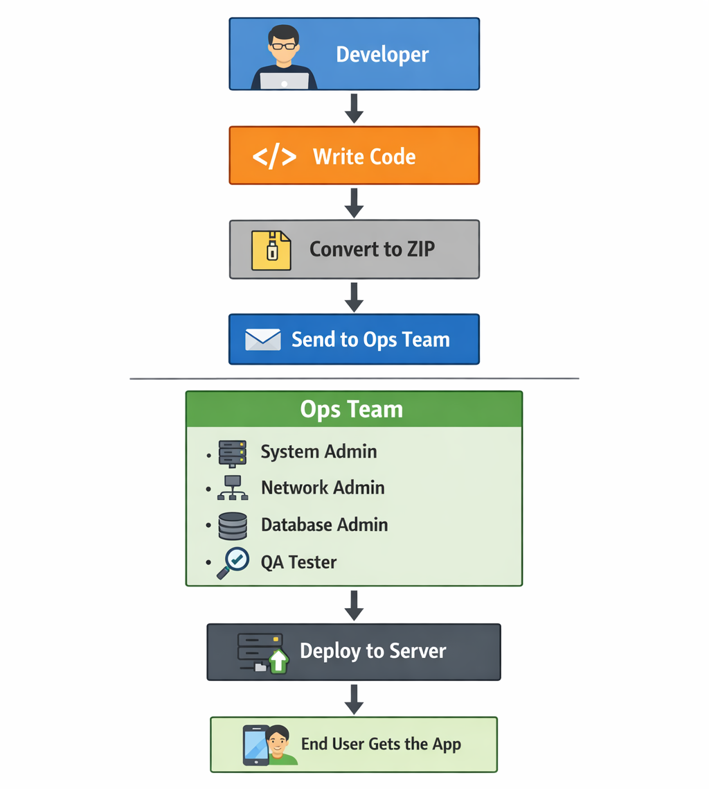
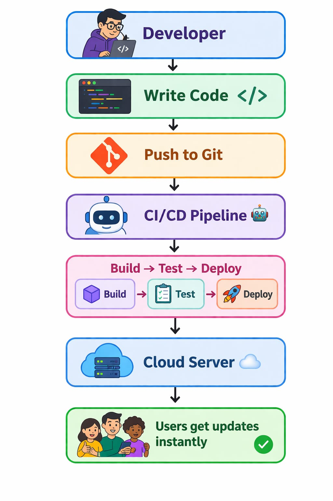
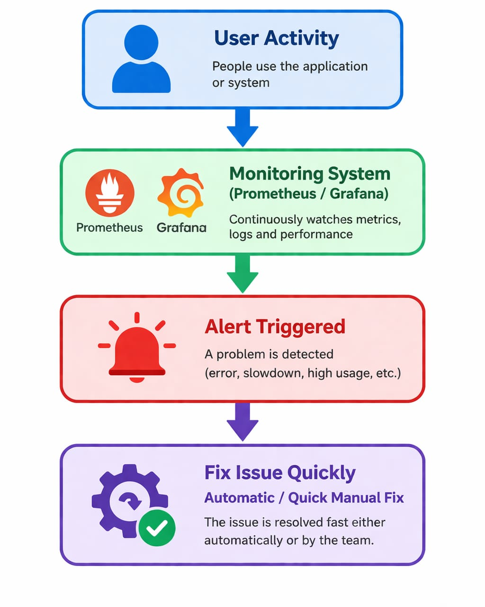

**DevOps Overview — My Day 01 Learning**

Most beginners think DevOps is about tools like:
- Docker or
- Kubernetes…

But today I learned something important:

DevOps is not about tools. It’s about mindset.

---

**Why DevOps Exists**

Today, every industry runs on software:

- Fin Tech 
- Ed Tech 
- AI Tech 

-> And all of them need:

- Speed
- Automation
- Scalability

Because…

- Users don’t wait anymore.

---

**The Old Way (Before DevOps)**

Here’s how software delivery used to work:

-> Problems:
- Slow delivery (weeks/months)
- Too many dependencies
- Poor communication
- Manual work
- High chances of failure

---

**Traditional DevOps Flow:**

The Real Problem:

You build an app on your laptop 

But…

How does it reach the user?

The DevOps Solution

Simple but powerful idea:

`Developers + Operations work together`

---

---

**Modern DevOps Flow:**

DevOps =
- Culture 
- Collaboration 
- Automation 
- Speed 

---

Goals of DevOps
- Faster delivery
- Automation
- Continuous updates
- Fewer errors
- Easy scaling
- Reliability (SRE)

Goal: Build systems that don’t fail easily

---

-> Open Source Reality

Open Source is not just free 

It means:

- Learn 
- Build 
- Contribute 
- Share 

---

Key Insight:

- 90%+ applications run on Linux 

---

**Final Learning**

DevOps is NOT:

- Just tools
- Just commands

DevOps IS:

✅ Mindset
✅ Teamwork
✅ Automation
✅ Problem-solving

---

- DevOps = Deliver software faster, better, and smarter

---

“Small daily progress leads to big results.”
