# Day 87 -- Introduction to Agentic AI for DevOps
---

## Challenge Tasks

### Task 1: Understand Agentic AI for DevOps

1. **What is an AI agent?**
   - An LLM (Large Language Model) that can use **tools** to interact with the real world
   - Unlike a chatbot that only generates text, an agent can run commands, read files, call APIs
   - The LLM decides which tool to use, with what arguments, based on the user's question

2. **Why agents for DevOps?**
   - DevOps is tool-heavy: `docker`, `kubectl`, `terraform`, `gh`, `ansible` -- all CLI-based
   - An agent wraps these CLIs as tools and lets the LLM reason about their output
   - Example: "Why is my pod crashing?" -> agent calls `kubectl get pods`, sees `CrashLoopBackOff`, calls `kubectl describe pod`, reads the events, explains the root cause

3. **The ReAct pattern** (Reason + Act):
   ```
   User: "Why is broken-app crashing?"

   Agent THINKS: I should check which containers are running
   Agent ACTS:   calls list_containers()
   Agent OBSERVES: broken-app is in "Restarting" state

   Agent THINKS: I should check the logs
   Agent ACTS:   calls get_logs("broken-app")
   Agent OBSERVES: "exit code 1" after "app starting..."

   Agent THINKS: The container exits immediately after starting
   Agent ANSWERS: "The container crashes because the entrypoint
                   command exits with code 1 after 2 seconds..."
   ```

4. **Key components:**
   - **LLM** -- the brain (Ollama/Gemma 4 locally, or Claude/GPT for production)
   - **Tools** -- Python functions that wrap CLI commands (the hands)
   - **Agent framework** -- LangChain's `create_react_agent` orchestrates the reasoning loop
   - **MCP (Model Context Protocol)** -- a standard for exposing tools to any AI client (Day 88)

---

### 1. What is an AI Agent?

An **AI agent** is an application powered by a **Large Language Model (LLM)** that can use external **tools** to perform tasks in the real world.

Unlike a traditional chatbot that only generates text, an AI agent can:

* Execute shell or CLI commands
* Read files and logs
* Call REST APIs
* Query databases
* Interact with cloud services
* Make decisions about which tool to use based on the user's request

The LLM acts as the **brain**, while the tools act as the **hands**.

### Chatbot vs AI Agent

| Chatbot                        | AI Agent                                           |
| ------------------------------ | -------------------------------------------------- |
| Generates text responses       | Uses tools to perform actions                      |
| Answers based on training data | Collects real-time information using tools         |
| Cannot interact with systems   | Can run commands, call APIs, and inspect resources |
| One-step response              | Multi-step reasoning and execution                 |

### Example

**User:**

> Why is my Docker container not starting?

A chatbot may only suggest common reasons.

An AI agent can actually execute:

```bash
docker ps -a
docker logs my-container
docker inspect my-container
```

It analyzes the outputs and then explains the actual root cause.

---

## 2. Why Agents for DevOps?

DevOps engineers spend much of their time using command-line tools such as:

* Docker
* kubectl
* Terraform
* GitHub CLI (gh)
* Ansible
* Helm
* AWS CLI

An AI agent can wrap these CLI commands as **tools**. Instead of manually running each command, the agent decides which commands are needed, executes them, analyzes the outputs, and provides a diagnosis.

### Example

**User:**

> Why is my pod crashing?

The agent follows these steps:

1. Runs:

```bash
kubectl get pods
```

Finds:

```
CrashLoopBackOff
```

2. Runs:

```bash
kubectl describe pod broken-app
```

Reads the Events section.

3. Runs:

```bash
kubectl logs broken-app
```

Reads the application logs.

4. Combines all observations and explains the root cause along with possible fixes.

This reduces manual troubleshooting and speeds up incident resolution.

---

## 3. The ReAct Pattern (Reason + Act + Observe)

**ReAct** stands for:

* **Reason** – Decide what should be done next.
* **Act** – Execute the appropriate tool.
* **Observe** – Analyze the tool's output.

The agent repeats this cycle until it has enough information to answer.

### Example

**User:**

> Why is broken-app crashing?

**Reason**

"I should first check the container status."

↓

**Action**

```python
list_containers()
```

↓

**Observation**

```
broken-app
Restarting
```

↓

**Reason**

"I should inspect the logs."

↓

**Action**

```python
get_logs("broken-app")
```

↓

**Observation**

```
app starting...
exit code 1
```

↓

**Reason**

"I should inspect the container details."

↓

**Action**

```python
inspect_container("broken-app")
```

↓

**Observation**

```
ExitCode: 1
```

↓

**Final Answer**

> The container starts successfully but exits after two seconds with exit code 1. Docker restarts it continuously because the entrypoint command is failing.

The important point is that the user never instructed the agent to check logs or inspect the container. The agent determined the required steps on its own.

---

## 4. Key Components of an AI Agent

### A. LLM (The Brain)

The **Large Language Model (LLM)** is responsible for understanding the user's request, reasoning about the problem, deciding which tools to use, interpreting the outputs, and generating the final response.

Examples:

* Ollama + Gemma 4 (local)
* GPT (OpenAI)
* Claude (Anthropic)

Without an LLM, there is no intelligent decision-making.

---

### B. Tools (The Hands)

Tools are Python functions that perform real actions by wrapping CLI commands or APIs.

Example:

```python
@tool
def list_containers():
    """List all Docker containers."""
```

Internally, this tool executes:

```bash
docker ps -a
```

Other examples include:

* `docker logs`
* `docker inspect`
* `kubectl get pods`
* `terraform plan`
* `gh repo list`

The LLM reads the tool's description (docstring) to decide when to use it.

---

### C. Agent Framework

An agent framework manages the interaction between the LLM and the available tools.

In this course, the framework is **LangChain**.

Using:

```python
create_react_agent()
```

LangChain automatically implements the ReAct loop:

```
User Question
      ↓
LLM Reasons
      ↓
Choose Tool
      ↓
Execute Tool
      ↓
Observe Output
      ↓
Reason Again
      ↓
Final Answer
```

This removes the need to manually write the reasoning logic.

---

### D. MCP (Model Context Protocol)

**Model Context Protocol (MCP)** is an open standard that allows AI models to discover and use tools in a consistent way.

Instead of creating separate integrations for every AI model, MCP provides a standardized interface for exposing tools such as:

* File systems
* Databases
* GitHub
* Docker
* Kubernetes
* Cloud services

This enables different AI clients to use the same tools without custom implementations.

> **Note:** MCP will be covered in more detail on Day 88.

---

### Summary

* An **AI agent** is an LLM that can use external tools to perform tasks.
* Unlike chatbots, agents can execute commands, read logs, call APIs, and make decisions.
* DevOps is an ideal domain for AI agents because most tasks involve CLI tools like Docker, Kubernetes, Terraform, and Ansible.
* The **ReAct** pattern (**Reason → Act → Observe**) enables agents to solve problems step by step.
* An AI agent consists of four main components:

  * **LLM** – the brain
  * **Tools** – the hands
  * **Agent Framework (LangChain)** – orchestrates reasoning and tool usage
  * **MCP** – a standard protocol for exposing tools to AI models


---

### Task 2: Set Up the Environment
Clone the reference repository:
```bash
git clone https://github.com/TrainWithShubham/agentic-ai-for-devops.git
cd agentic-ai-for-devops
```


**Install Ollama** (local LLM runtime -- free, no API keys):
```bash
# macOS
brew install ollama

# Linux
curl -fsSL https://ollama.com/install.sh | sh
```


Start Ollama and pull the Gemma 4 model:
```bash
ollama serve &
ollama pull gemma4
```


Verify:
```bash
ollama list
# Should show gemma4 in the list
```
**Set up Python environment:**
```bash
python3 -m venv .venv
source .venv/bin/activate

pip install -r requirements.txt
```


The `requirements.txt` installs:
- `ollama` -- Python client for Ollama
- `langchain` + `langchain-ollama` -- agent framework + Ollama integration
- `langgraph` -- graph-based agent execution (used by `create_react_agent`)
- `fastmcp` -- Model Context Protocol server framework
- `langchain-mcp-adapters` -- bridges MCP tools into LangChain

**Run the pre-flight check:**
```bash
python3 module-0/verify_setup.py
```

You should see:
```
  [PASS] Python 3.10+
  [PASS] Docker
  [PASS] kubectl
  [PASS] Kind
  [PASS] Ollama + gemma4

  5/5 -- you're ready for Day 1!
```

Fix any failures before proceeding.


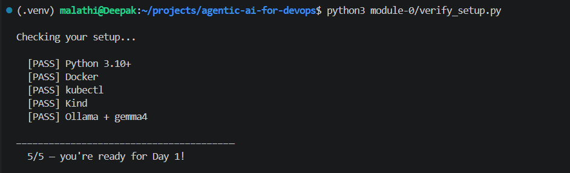

---

### Task 3: Build the Docker Error Explainer (Module 1)
This is the simplest possible LLM usage -- no agents, no tools. You paste a Docker error and the LLM explains it.

Study `module-1/explainer.py`:
```python
import ollama

SYSTEM_PROMPT = """You are a Docker expert. When given a Docker error, explain:
1. What went wrong (plain English)
2. Most likely cause
3. How to fix it (with commands)
Keep it short."""

# ... reads user input ...

response = ollama.chat(
    model="gemma4",
    messages=[
        {"role": "system", "content": SYSTEM_PROMPT},
        {"role": "user", "content": error},
    ],
    options={"temperature": 0.3},
)
```

**Key concepts:**
- `system` prompt -- tells the LLM what persona to adopt and how to format responses
- `temperature: 0.3` -- low temperature = more deterministic output (good for technical answers)
- No tools, no agent loop -- just a single LLM call

**Run it:**
```bash
python3 module-1/explainer.py
```

Paste one of these Docker errors:
```
docker: Error response from daemon: Conflict. The container name "/myapp" is already in use.
```

Or:
```
Error response from daemon: driver failed programming external connectivity on endpoint myapp:
Bind for 0.0.0.0:8080 failed: port is already allocated.
```

Or:
```
Error response from daemon: pull access denied for mycompany/private-app, repository does not
exist or may require 'docker login'.
```

The LLM explains what went wrong and how to fix it -- no manual Googling needed.


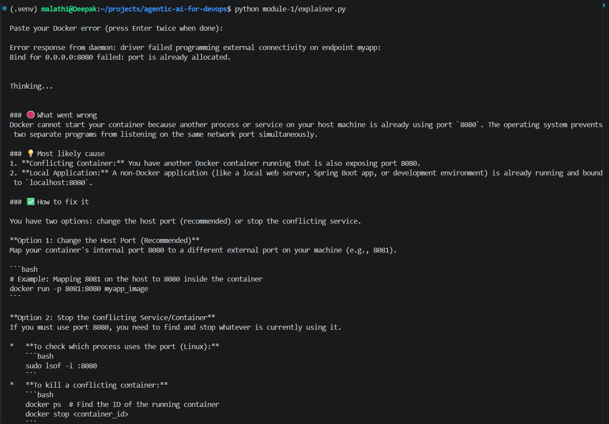


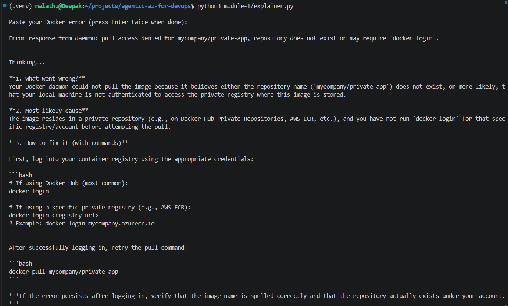


**Document:** How does the system prompt affect the quality of the response? Try changing it and see what happens.

## Effect of the System Prompt on the Response

The **system prompt** defines the AI model's role, behavior, tone, and response format. It guides the model on how to interpret the user's input and what kind of output to produce.

### Original System Prompt

```python
SYSTEM_PROMPT = """You are a Docker expert. When given a Docker error, explain:
1. What went wrong (plain English)
2. Most likely cause
3. How to fix it (with commands)
Keep it short."""
```

**Observation:**
- Responses were concise and technical.
- The explanation was well-structured.
- The model included relevant Docker commands to fix the issue.
- Suitable for developers and DevOps engineers.

### Modified System Prompt

```python
SYSTEM_PROMPT = """
You are teaching Docker to complete beginners.

Explain:
1. The error in simple English.
2. Why it happened.
3. Give a real-world analogy.
4. Show the commands to fix it.
"""
```

**Observation:**
- Responses became more detailed and beginner-friendly.
- The model used simpler language and provided additional explanations.
- Real-world analogies made the concepts easier to understand.
- The response was longer than with the original prompt.

### Conclusion

Changing the system prompt significantly changes the quality and style of the response. A well-designed system prompt produces more focused, consistent, and useful answers by clearly defining the model's role, tone, audience, and expected output format.

---

### Task 4: Build the Docker Troubleshooter Agent (Module 2)
Now the real thing -- an agent that autonomously uses tools to diagnose Docker issues.

**First, create a broken container to diagnose:**
```bash
docker run -d --name broken-app nginx:alpine sh -c "echo 'app starting...' && sleep 2 && exit 1"
```

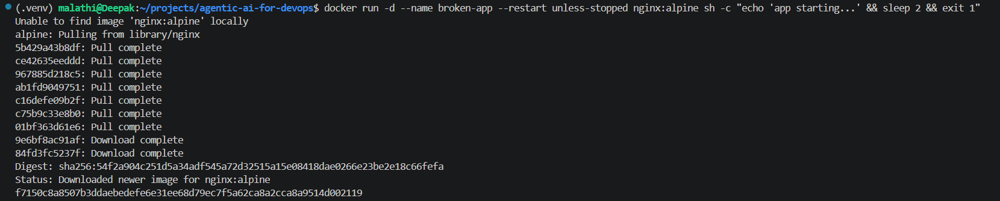
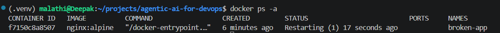

This container starts, prints "app starting...", waits 2 seconds, then crashes. Docker will keep restarting it (CrashLoopBackOff equivalent).

**Study `module-2/agent.py`:**

The agent has three tools:
```python
@tool
def list_containers() -> str:
    """List all Docker containers (running and stopped)."""
    result = subprocess.run(["docker", "ps", "-a"], capture_output=True, text=True)
    return result.stdout or result.stderr

@tool
def get_logs(container_name: str) -> str:
    """Get the last 50 lines of logs from a Docker container."""
    result = subprocess.run(
        ["docker", "logs", "--tail", "50", container_name],
        capture_output=True, text=True,
    )
    return result.stdout + result.stderr

@tool
def inspect_container(container_name: str) -> str:
    """Get detailed info about a Docker container (state, config, network)."""
    result = subprocess.run(
        ["docker", "inspect", container_name],
        capture_output=True, text=True,
    )
    return result.stdout or result.stderr
```

**How each tool works:**
- `@tool` decorator -- tells LangChain this function is available for the agent
- The docstring is critical -- the LLM reads it to decide when to use the tool
- `subprocess.run` -- executes the actual CLI command
- Returns stdout/stderr as a string for the LLM to read

**The agent is created with:**
```python
llm = ChatOllama(model="gemma4", temperature=0)
tools = [list_containers, get_logs, inspect_container]
agent = create_react_agent(llm, tools)
```

`create_react_agent` builds the ReAct loop: the LLM reasons about the problem, picks a tool, calls it, reads the result, and repeats until it has an answer.

**Run the agent:**
```bash
python3 module-2/agent.py
```

Ask it:
```
> Why is broken-app crashing?
```

Watch the agent's reasoning:
1. It calls `list_containers()` -- sees broken-app in "Restarting" state
2. It calls `get_logs("broken-app")` -- sees "app starting..." then exit
3. It calls `inspect_container("broken-app")` -- sees exit code 1
4. It answers: "The container crashes because the command exits with code 1..."

**The LLM decided which tools to call and in what order.** You never told it to check logs -- it figured that out from the problem.

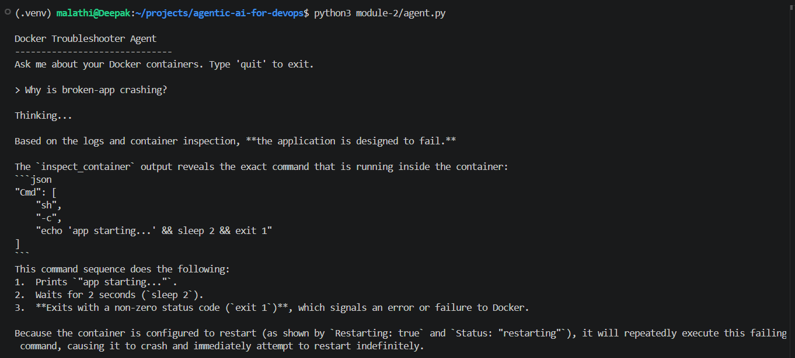

Try more questions:
```
> List all my running containers
> What image is broken-app using?
```


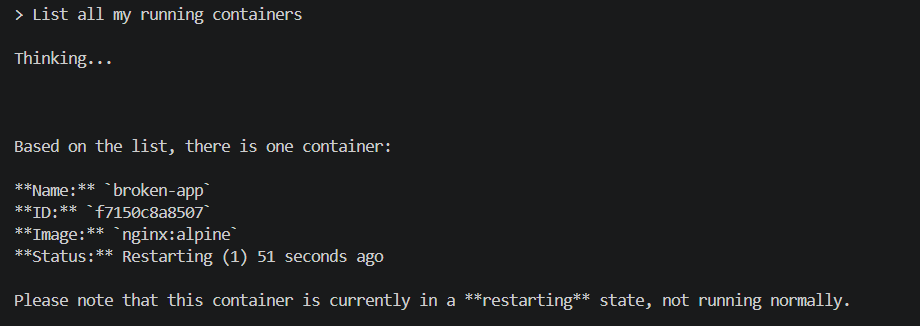

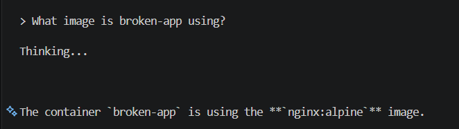

**Clean up:**
```bash
docker rm -f broken-app
```

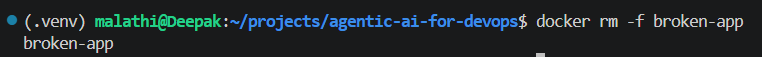


---

### Task 5: Understand the Agent Architecture
Map out what you just built:

```
[User Question]
      |
      v
[LLM: Gemma 4 via Ollama]
      |
      | (ReAct: Reason what tool to use)
      v
[Tool Selection]
      |
      +---> list_containers()   --> docker ps -a
      +---> get_logs()          --> docker logs
      +---> inspect_container() --> docker inspect
      |
      v
[Tool Output (text)]
      |
      v
[LLM reads output, reasons again]
      |
      | (repeat until answer is ready)
      v
[Final Answer to User]
```

**Why this matters for DevOps:**
- The pattern is domain-agnostic. Replace Docker tools with Kubernetes tools, Terraform tools, or AWS CLI tools -- the architecture stays the same
- Tomorrow (Day 88) you will add Kubernetes tools to the same agent
- On Day 89, you will build a production-grade agent that automatically fixes broken pods

**The tool pattern is always the same:**
```python
@tool
def my_tool(argument: str) -> str:
    """Description the LLM reads to decide when to use this tool."""
    result = subprocess.run(["some-cli", "command", argument], capture_output=True, text=True)
    return result.stdout or result.stderr
```

Any CLI command can become an agent tool. Any DevOps workflow can be automated this way.

---

## Agent Architecture

```text
                    User Question
                         │
                         ▼
             LLM (Gemma 4 via Ollama)
                         │
      ReAct: Reason about which tool to use
                         │
                         ▼
                  Tool Selection
                         │
        ┌────────────────┼────────────────┐
        │                │                │
        ▼                ▼                ▼
list_containers()   get_logs()   inspect_container()
      │                │                │
docker ps -a      docker logs    docker inspect
        └────────────────┼────────────────┘
                         │
                         ▼
               Tool Output (Text)
                         │
                         ▼
      LLM reads the output and reasons again
                         │
        (Repeat until enough information)
                         │
                         ▼
               Final Answer to the User
```

---

## How It Works

1. The user asks a question (for example, *"Why is broken-app crashing?"*).
2. The LLM (Gemma 4 running locally through Ollama) analyzes the question.
3. Using the **ReAct (Reason → Act → Observe)** pattern, it decides which tool should be used first.
4. The selected tool executes the corresponding Docker CLI command using `subprocess.run()`.
5. The tool returns the command output as plain text.
6. The LLM reads the output, reasons again, and decides whether another tool is needed.
7. This process repeats until the LLM has enough information to provide a complete answer.

---

## Why This Matters for DevOps

This architecture is **domain-agnostic**, meaning the same reasoning process can automate different DevOps tasks by replacing the underlying tools.

For example:

| DevOps Domain | CLI Tool      | Example Command                            |
| ------------- | ------------- | ------------------------------------------ |
| Docker        | Docker CLI    | `docker ps`, `docker logs`                 |
| Kubernetes    | kubectl       | `kubectl get pods`, `kubectl describe pod` |
| Terraform     | Terraform CLI | `terraform plan`, `terraform apply`        |
| GitHub        | GitHub CLI    | `gh repo list`, `gh workflow run`          |
| AWS           | AWS CLI       | `aws ec2 describe-instances`               |
| Ansible       | Ansible CLI   | `ansible-playbook`                         |

The AI agent does not change—only the available tools change.

This means the same architecture can be extended from Docker troubleshooting to Kubernetes debugging, Terraform automation, cloud management, and other DevOps workflows.

---

## Generic Tool Pattern

Every tool follows the same structure:

```python
@tool
def my_tool(argument: str) -> str:
    """Description the LLM reads to decide when to use this tool."""
    result = subprocess.run(
        ["some-cli", "command", argument],
        capture_output=True,
        text=True
    )
    return result.stdout or result.stderr
```

### Components

* **`@tool` decorator**: Registers the function as a tool the AI agent can use.
* **Docstring**: Describes the tool's purpose. The LLM reads this description to determine when it should use the tool.
* **`subprocess.run()`**: Executes the actual CLI command.
* **Return value**: The command output is returned as a string so the LLM can analyze and reason about it.

---

## Key Takeaways

* The LLM acts as the **brain**, making decisions and reasoning about the problem.
* Tools act as the **hands**, executing real-world CLI commands.
* LangChain's `create_react_agent()` orchestrates the ReAct reasoning loop.
* The same architecture can automate Docker, Kubernetes, Terraform, AWS CLI, GitHub CLI, Ansible, and many other DevOps workflows by simply changing the available tools.
* Any CLI command can be wrapped as a tool, allowing AI agents to automate repetitive operational tasks and assist with infrastructure troubleshooting.


---

### Task 6: Experiment and Extend
Try adding a new tool to the agent. Edit `module-2/agent.py` and add:

```python
@tool
def list_images() -> str:
    """List all Docker images on this machine with their sizes."""
    result = subprocess.run(["docker", "images"], capture_output=True, text=True)
    return result.stdout or result.stderr
```

Add it to the tools list:
```python
tools = [list_containers, get_logs, inspect_container, list_images]
```

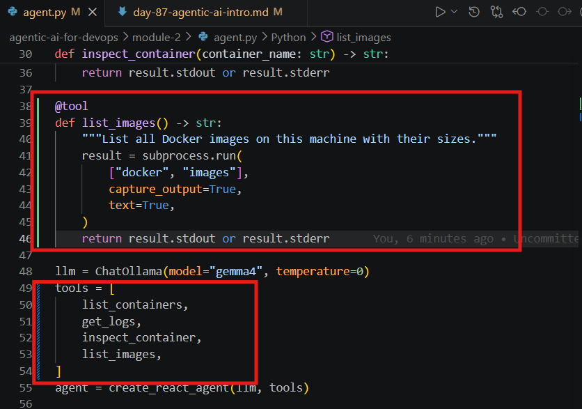

Run the agent and ask: "What images do I have and how much space are they using?"

The agent will call your new tool.


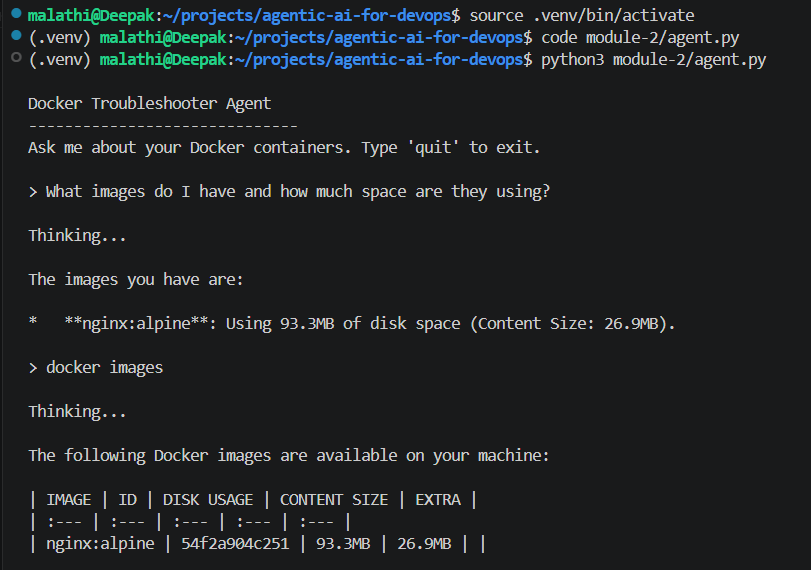

**Try another:** Add a `restart_container` tool:
```python
@tool
def restart_container(container_name: str) -> str:
    """Restart a Docker container."""
    result = subprocess.run(["docker", "restart", container_name], capture_output=True, text=True)
    return result.stdout or result.stderr
```

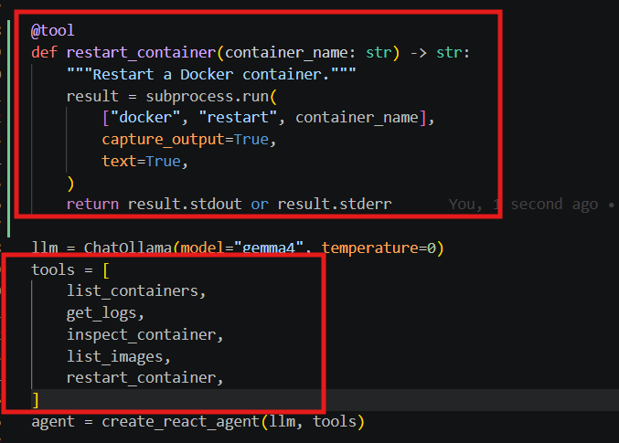

Now ask: "broken-app keeps crashing, can you restart it?"

**Think about the safety implications:** This tool can restart any container. In production, you would add guardrails (confirmation prompts, allowed container lists). You will learn about guardrails on Day 89.


---

# Documentation


---

# 1. What are AI Agents?

An **AI Agent** is an application powered by a Large Language Model (LLM) that can use external tools to interact with real systems.

Unlike a chatbot that only generates text, an AI agent can:

- Execute shell/CLI commands
- Read files and logs
- Call APIs
- Inspect infrastructure
- Make decisions about which tool to use
- Perform multi-step reasoning before answering

### AI Agent vs Chatbot

| Chatbot | AI Agent |
|----------|----------|
| Generates text responses | Uses external tools to perform actions |
| Answers based on training data | Collects real-time information using tools |
| Cannot interact with systems | Can execute CLI commands, APIs, and scripts |
| Single-step response | Multi-step reasoning and execution |

Example:

User:
> Why is my Docker container crashing?

A chatbot guesses possible reasons.

An AI agent actually runs:

```bash
docker ps -a
docker logs broken-app
docker inspect broken-app
```

It then analyzes the outputs before providing the root cause.

---

# 2. The ReAct Pattern (Reason → Act → Observe)

The Docker Troubleshooter Agent follows the ReAct pattern.

### Example

User:

> Why is broken-app crashing?

**Reason**

The agent decides to check running containers.

↓

**Action**

```
list_containers()
```

↓

**Observation**

```
broken-app is Restarting
```

↓

**Reason**

The agent decides to inspect the logs.

↓

**Action**

```
get_logs("broken-app")
```

↓

**Observation**

```
app starting...
exit code 1
```

↓

**Reason**

The agent decides to inspect the container configuration.

↓

**Action**

```
inspect_container("broken-app")
```

↓

**Observation**

```
ExitCode: 1
```

↓

**Final Answer**

The container starts successfully, prints *"app starting..."*, waits two seconds, exits with code **1**, and Docker continuously restarts it because the restart policy is enabled.

---

# 3. Environment Setup

Repository:

```bash
git clone https://github.com/TrainWithShubham/agentic-ai-for-devops.git
cd agentic-ai-for-devops
```

Installed and configured:

- Ollama
- Gemma 4
- Python Virtual Environment
- LangChain
- LangGraph
- FastMCP
- LangChain-Ollama

### Verification

Executed:

```bash
python3 module-0/verify_setup.py
```

Output:

```
Checking your setup...

[PASS] Python 3.10+
[PASS] Docker
[PASS] kubectl
[PASS] Kind
[PASS] Ollama + gemma4

5/5 — you're ready for Day 1!
```

---

# 4. Docker Error Explainer

The Docker Error Explainer is the simplest use of an LLM.

It receives a Docker error message and explains:

- What went wrong
- Most likely cause
- Commands to fix the issue

There is **no agent** and **no tools** involved.

Flow:

```
User Input
      │
      ▼
System Prompt
      │
      ▼
Gemma 4
      │
      ▼
Explanation
```

### Screenshot

> **Refer above Screenshot:** Docker Error Explainer

---

# 5. Docker Troubleshooter Agent

Unlike the Error Explainer, this application is an AI agent.

Available tools:

- `list_containers()`
- `get_logs(container_name)`
- `inspect_container(container_name)`

When asked:

> Why is broken-app crashing?

The agent automatically:

1. Listed Docker containers.
2. Found **broken-app** restarting.
3. Retrieved container logs.
4. Inspected the container.
5. Determined that the startup command intentionally exits with **exit code 1**.
6. Explained the root cause.

The LLM decided which tools to use without explicit instructions.

### Screenshot

> **Refer above Screenshot:** Docker Troubleshooter Agent diagnosing `broken-app`

---

# 6. Agent Architecture

```
                    User Question
                         │
                         ▼
             LLM (Gemma 4 via Ollama)
                         │
      ReAct: Reason about which tool to use
                         │
                         ▼
                  Tool Selection
                         │
        ┌────────────────┼────────────────┐
        │                │                │
        ▼                ▼                ▼
list_containers()   get_logs()   inspect_container()
      │                │                │
docker ps -a      docker logs    docker inspect
        └────────────────┼────────────────┘
                         │
                         ▼
               Tool Output (Text)
                         │
                         ▼
      LLM reads the output and reasons again
                         │
       (Repeat until enough information)
                         │
                         ▼
               Final Answer to the User
```

---

# 7. Tool Added

I extended the agent by adding a new tool:

```python
@tool
def list_images() -> str:
    """List all Docker images on this machine with their sizes."""
    result = subprocess.run(
        ["docker", "images"],
        capture_output=True,
        text=True,
    )
    return result.stdout or result.stderr
```

Added to the tools list:

```python
tools = [
    list_containers,
    get_logs,
    inspect_container,
    list_images,
]
```

When I asked:

> What images do I have and how much space are they using?

The agent automatically selected the `list_images()` tool, executed the `docker images` command, and summarized the available images and their sizes.

---

# 8. System Prompt and Temperature

## System Prompt

The system prompt defines the role, behavior, and response format of the LLM.

Original prompt:

```python
SYSTEM_PROMPT = """
You are a Docker expert.
Explain:
1. What went wrong
2. Most likely cause
3. How to fix it
Keep it short.
"""
```

### Observation

Changing the system prompt significantly changed the response quality:

- The original prompt produced concise, technical answers.
- A beginner-focused prompt generated simpler explanations with more detail.
- A senior DevOps prompt produced structured, command-oriented responses.

A well-designed system prompt makes responses more consistent, focused, and useful.

---

## Temperature

The project uses:

```python
temperature = 0.3
```

Temperature controls randomness.

| Temperature | Behaviour |
|--------------|-----------|
| 0 | Fully deterministic |
| 0.3 | Stable technical responses |
| 0.7 | More varied wording |
| 1.0 | Creative but less predictable |

For DevOps troubleshooting, a low temperature is preferred because it produces reliable and consistent answers.

---

# Key Learnings

- AI agents differ from chatbots by using tools to perform real actions.
- The ReAct pattern enables multi-step reasoning before answering.
- LangChain's `create_react_agent()` orchestrates the reasoning loop.
- Docker CLI commands can be wrapped as tools using the `@tool` decorator.
- The same architecture can be extended to Kubernetes, Terraform, AWS CLI, GitHub CLI, and other DevOps tools.
- Effective system prompts and low temperatures improve the consistency and quality of technical responses.

---

# Conclusion

Day 87 introduced the foundations of Agentic AI for DevOps. I successfully configured a local LLM with Ollama and Gemma 4, built a Docker Error Explainer using a single LLM call, and created a Docker Troubleshooter Agent capable of autonomously diagnosing Docker container failures using the ReAct reasoning pattern. By wrapping Docker CLI commands as tools, the agent was able to inspect containers, analyze logs, and explain failures without being explicitly told which commands to execute. This architecture can be extended to Kubernetes, Terraform, cloud platforms, and other DevOps automation workflows.